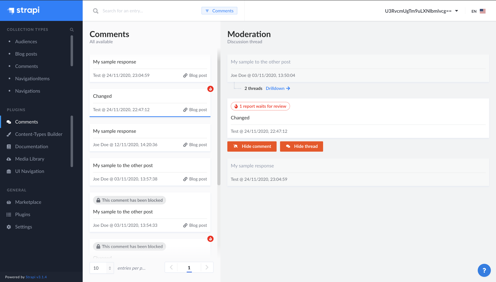

# Strapi - Comments plugin

<p align="center">
  <a href="https://www.npmjs.org/package/strapi-plugin-comments">
    
  </a>
  <a href="https://www.npmjs.org/package/strapi-plugin-comments">
    
  </a>
  <a href="https://circleci.com/gh/VirtusLab-Open-Source/strapi-plugin-comments">
    
  </a>
  <a href="https://codecov.io/gh/VirtusLab-Open-Source/strapi-plugin-comments">
    
  </a>
</p>

A plugin for [Strapi Headless CMS](https://github.com/strapi/strapi) that provides end to end comments feature with their moderation panel, bad words filtering, abuse reporting and more.



### ⏳ Installation

(Use **yarn** to install this plugin within your Strapi project (recommended). [Install yarn with these docs](https://yarnpkg.com/lang/en/docs/install/).)

```bash
yarn add strapi-plugin-comments@latest
```

After successful installation you've to build a fresh package that includes  plugin UI. To archive that simply use:

```bash
yarn build
yarn develop
```

or just run Strapi in the development mode with `--watch-admin` option:

```bash
yarn develop --watch-admin
```

The **Comments** plugin should appear in the **Plugins** section of Strapi sidebar after you run app again.

Enjoy 🎉

### 🖐 Requirements

Complete installation requirements are exact same as for Strapi itself and can be found in the documentation under <a href="https://strapi.io/documentation/v3.x/installation/cli.html#step-1-make-sure-requirements-are-met">Installation Requirements</a>.

**Supported Strapi versions**:

- Strapi v3.6.8 (recently tested)
- Strapi v3.x

(This plugin may work with the older Strapi versions, but these are not tested nor officially supported at this time.)

**We recommend always using the latest version of Strapi to start your new projects**.

## Features

- **Comments Public API:** Elegant, entirely customizable and a fully extensible admin panel.
- **Strapi &amp; generic users:** Support for built-in &amp; also generic non-Strapi users that might be the comments authors.
- **Any Content Type relation:** Comments can by linked to any of your Content Types by default. Simply, you're controlling it.
- **Moderation Panel:** Search & Filter through the bucket with your auditory comments. Manage them by blocking single ones or full threads. All in combined list &amp; hierarchical tree view of threads.
- **Automated Bad Words filtering:** By detault end users are not allowed to post abusing comments where bad words have been used.
- **Abuse Reporting & Reviewing:** Don't allow inferior language, react to reports from your community

## Content Type model relation to Comment

To enable Content Type to work with Comments, you've to add following field to your model `*.settings.json`:

```
    "comments": {
      "plugin": "comments",
      "collection": "comment",
      "via": "related"
    }
```

inside the `attributes` section like in example below:

```
    "attributes": {
        ...,
        "comments": {
            "plugin": "comments",
            "collection": "comment",
            "via": "related"
        },
        ...
    },
```

## Configuration
To setup amend default plugin configuration we recommend to put following snippet as part of `config/plugins.js` or `config/<env>/plugins.js` file. If the file does not exist yet, you have to create it manually. If you've got already configurations for other plugins stores by this way, use just the `comments` part within exising `plugins` item.

```
    ...
    comments: {
      enableUsers: true,
      badWords: false
    },
    ...
```

### Properties
- `enableUsers` - Enabled support for built-in Strapi users, if endpoints are exposed with usage of `Authenticated` policy or JWT tokens are in use by the Client App. Default value: `false`.
- `badWords` - Enabled support for (bad words filtering)[https://www.npmjs.com/package/bad-words]. Can be turned off or overwritten using (options reference)[https://www.npmjs.com/package/bad-words#constructor]. Default value: `true`. 

## Additional GQL Configuration

> **Note**
> Introduced in `v1.0.2`

```
    ...
    comments: {
      enableUsers: true,
      badWords: false,
      relatedContentTypes: {
        pages: {
          uuid: 'application::pages.pages',
          contentManager: true,
          isSingle: true, // optional
          __contentType: '',
          key: 'title',
          value: 'id',
          url: 'my-custom-url/:id' // optional
        }
      }
    },
    ...
```

### Properties
- `relatedContentTypes` - list of properties where each single one reflects the related collection like `pages`, `posts`, etc. Each of collection properties should contain following set:
    - `uuid` - strapi content type `uuid`
    - `contentManager` - boolean to mark if element taken from **Strapi Content Manager** or maybe custom plugin
    - `isSingle` (optional) - boolean to identify collection type or single type
    - `key/value` - will be used to take id and example title to display link on the list
    - `url` (optional) - to be defined if `contentManager` is set to **false**. Reflects the custom url that returns the content type items. With id as identifier - which is dynamically replaced

## Public API Comment model

### Generic (non Strapi User)
```
{
    "id": 1,
    "content": "My comment content",
    "blocked": null,
    "blockedThread": true,
    "blockReason": null,
    "points": 1,
    "authorUser": null,
    "authorId": "207ccfdc-94ba-45eb-979c-790f6f49c392",
    "authorName": "Joe Doe",
    "authorEmail": "jdoe@sample.com",
    "authorAvatar": null,
    "created_at": "2020-07-14T20:13:01.649Z",
    "updated_at": "2020-07-14T20:13:01.670Z"
}
```
### Strapi User
```
{
    "id": 1,
    "content": "My comment content",
    "blocked": true,
    "blockedThread": null,
    "blockReason": null,
    "points": null,
    "authorUser": {
        "id": 1,
        "username": "Sample User",
        "email": "user@sample.com",
        "provider": "local",
        "confirmed": true,
        "blocked": false,
        "role": 1,
        "created_at": "2020-07-10T08:38:03.157Z",
        "updated_at": "2020-07-10T08:38:03.170Z"
    },
    "authorId": null,
    "authorName": null,
    "authorEmail": null,
    "authorAvatar": null,
    "created_at": "2020-07-14T20:13:01.649Z",
    "updated_at": "2020-07-14T20:13:01.670Z"
}

```

## Public API specification

### Get Comments

`GET <host>/comments/<content-type>:<id>`

Return a hierarchical tree structure of comments for specified instance of Content Type like for example `Article` with `ID: 1`

**Example URL**: `https://localhost:1337/comments/article:1`

**Example response body**

```
[
    {
        -- Comment Model fields ---,
        children: [
            {
                -- Comment Model fields ---,
                children: [...]
            },
            ...
        ]
    },
    ...
]
```

### Get Comments (flat structure)

`GET <host>/comments/<content-type>:<id>/flat`

Return a flat structure of comments for specified instance of Content Type like for example `Article` with `ID: 1`

**Example URL**: `https://localhost:1337/comments/article:1/flat`

**Example response body**

```
[
    {
        -- Comment Model fields ---
    },
    {
        -- Comment Model fields ---
    },
    ...
]
```

**Possible response codes**
- `200` - Successful. Response with list of comments (can be empty)
- `400` - Bad Request. Requested list for not valid / not existing Content Type

### Post a Comment

`POST <host>/comments/<content-type>:<id>`

Posts a Comment related to specified instance of Content Type like for example `Article` with `ID: 1`

**Example URL**: `https://localhost:1337/comments/article:1`

**Example request body**

*Generic (non Strapi User)*
```
{
	"authorId": "<any ID like value>",
	"authorName": "Joe Doe",
	"authorEmail": "jdoe@sample.com",
	"content": "My sample response",
	"threadOf": 2, // id of comment we would like to start / continue the thread (Optional)
	"related": [{
		"refId": 1,
		"ref": "article",
		"field": "comments"
	}] 
}
```

*Strapi user*
```
{
	"authorUser": 1, // id of a author user. Optional in case of 'enableUsers: true' in the plugin configuration
	"content": "My sample response",
	"threadOf": 2, // id of comment we would like to start / continue the thread (Optional)
	"related": [{
		"refId": 1,
		"ref": "article",
		"field": "comments"
	}] 
}
```

**Example response body**

```
{
    -- Comment Model fields ---
}
```

**Possible response codes**
- `200` - Successful. Response with created Comment Model
- `400` - Bad Request. Missing field values or bad words check fails. Error message will provide relevant reason.

### Update Comment

`PUT <host>/comments/<content-type>:<id>/comment/<commentId>`

Updates a specified Comment content based on it `commentId` and related to specified instance of Content Type like for example `Article` with `ID: 1`

**Example URL**: `https://localhost:1337/comments/article:1/comment/2`

**Example request body**

*Generic (non Strapi User)*
```
{
	"authorId": "<any ID like value>",
	"authorName": "Joe Doe",
	"authorEmail": "jdoe@sample.com",
	"content": "My sample response"
}
```

*Strapi user*
```
{
	"authorUser": 1, // id of a author user. Optional in case of 'enableUsers: true' in the plugin configuration
	"content": "My sample response"
}
```

**Example response body**

```
{
    -- Comment Model fields ---
}
```

**Possible response codes**
- `200` - Successful. Response with updated Comment Model
- `400` - Bad Request. Missing field values or bad words check fails. Error message will provide relevant reason.
- `409` - Conflict. Occurs when trying to update a non existing or not own comment. Possible cause might be that `authorId` or `authorUser` mismatch with existing comment.

### Delete Comment

`DELETE <host>/comments/<content-type>:<id>/<commentId>?authorId=<authorId>`

Deletes a specified Comment based on it `commentId` and related to specified instance of Content Type like for example `Article` with `ID: 1`.

**Example URL**: `https://localhost:1337/comments/article:1/1?authorId=1`

**Example response body**

```
{
    -- Empty Response ---
}
```

**Possible response codes**
- `200` - Successful with blank Response.
- `409` - Conflict. Occurs when trying to delete a non existing comment.

### Like Comment

`PATCH <host>/comments/<content-type>:<id>/comment/<commentId>/like`

Likes a specified Comment based on it `commentId` and related to specified instance of Content Type like for example `Article` with `ID: 1`.

**Example URL**: `https://localhost:1337/comments/article:1/comment/2/like`

**Example response body**

```
{
    -- Comment Model fields ---
}
```

**Possible response codes**
- `200` - Successful. Response with liked Comment Model.
- `409` - Conflict. Occurs when trying to like a non existing comment.

### Report abuse in the Comment

`POST <host>/comments/<content-type>:<id>/comment/<commentId>/report-abuse`

Reports abuse in specified Comment content based on it `commentId` and related to specified instance of Content Type like for example `Article` with `ID: 1` and requests moderator attention.

**Example URL**: `https://localhost:1337/comments/article:1/comment/2/report-abuse`

**Example request body**

```
{
	"reason": "<reason enum>",
	"content": "This comment is not relevant"
}
```

*Available reason enums:* `OTHER`, `BAD_WORDS`, `DISCRIMINATION`

**Example response body**

```
{
    -- Comment Abuse Report fields ---
}
```

**Possible response codes**
- `200` - Successful. Response with reported abuse.
- `409` - Conflict. Occurs when trying to report an abuse to a non existing comment.

## Examples

Live example of plugin usage can be found in the [VirtusLab Strapi Examples](https://github.com/VirtusLab/strapi-examples/tree/master/strapi-plugin-comments) repository.

## Contributing

Feel free to fork and make a Pull Request to this plugin project. All the input is warmly welcome!

## Community support

For general help using Strapi, please refer to [the official Strapi documentation](https://strapi.io/documentation/). For additional help, you can use one of these channels to ask a question:

- [Discord](https://discord.strapi.io/) We're present on official Strapi Discord workspace. Look for @cyp3r and DM.
- [Slack - VirtusLab Open Source](https://virtuslab-oss.slack.com) We're present on a public channel #strapi-molecules
- [GitHub](https://github.com/VirtusLab-Open-Source/strapi-plugin-comments/issues) (Bug reports, Contributions, Questions and Discussions)

## License

[MIT License](LICENSE.md) Copyright (c) [VirtusLab Sp. z o.o.](https://virtuslab.com/) &amp; [Strapi Solutions](https://strapi.io/).
