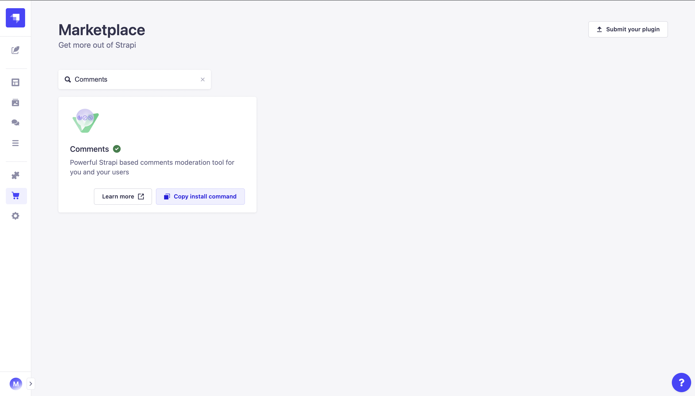
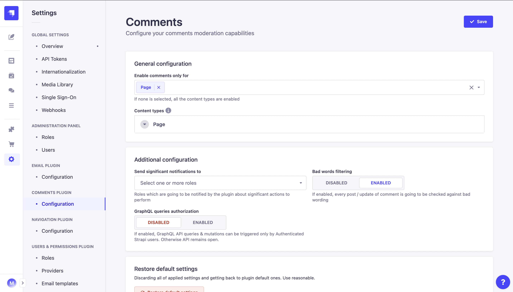

<div align="center" width="150px">
  
</div>
<div align="center">
  <h1>Strapi v4 - Comments plugin</h1>
  <p>Powerful Strapi based comments moderation tool for you and your users</p>
  <a href="https://www.npmjs.org/package/strapi-plugin-comments">
    
  </a>
  <a href="https://www.npmjs.org/package/strapi-plugin-comments">
    
  </a>
  <a href="https://circleci.com/gh/VirtusLab-Open-Source/strapi-plugin-comments">
    
  </a>
  <a href="https://codecov.io/gh/VirtusLab-Open-Source/strapi-plugin-comments">
    
  </a>
</div>

---

<div style="margin: 20px 0" align="center">
  
</div>

A plugin for [Strapi Headless CMS](https://github.com/strapi/strapi) that provides end to end comments feature with their moderation panel, bad words filtering, abuse reporting and much more.

### Table of Contents

1. [💎 Versions](#-versions)
2. [✨ Features](#-features)
3. [⏳ Installation](#-installation)
4. [🖐 Requirements](#-requirements)
5. [🔧 Configuration](#-configuration)
   - [Settings page](#in-v203-and-newer)
   - [Plugin file](#in-v202-and-older--default-configuration-state-for-v203-and-newer)
6. [🕸️ Public API - REST](#%EF%B8%8F-public-rest-api-specification)
7. [🕸️ Public API - GraphQL](#%EF%B8%8F-public-graphql-specification)
8. [🌿 Model lifecycle hooks](#model-life-cycle-hooks)
9. [⚗️ Custom fields](#-custom-fields)
10. [🧩 Examples](#-examples)
11. [💬 FAQ](#-faq)
12. [🤝 Contributing](#-contributing)
13. [👨‍💻 Community support](#-community-support)

## 💎 Versions

- **Strapi v5** - [v3.x](https://github.com/VirtusLab-Open-Source/strapi-plugin-comments)
- **Strapi v4** - (current) [v2.x](https://github.com/VirtusLab-Open-Source/strapi-plugin-comments/tree/strapi-v4)
- **Strapi v3** - [v1.x](https://github.com/VirtusLab-Open-Source/strapi-plugin-comments/tree/strapi-v3)

## ✨ Features

- **Comments Public REST + GraphQL API:** Elegant, entirely customizable and a fully extensible admin panel.
- **Strapi &amp; generic users:** Support for built-in &amp; also generic non-Strapi users that might be the comments authors.
- **Strapi Custom Fields support:** Improve an experience of your Content Types by using [dedicated set of custom fields](https://docs-v4.strapi.io/dev-docs/custom-fields) for each of them and automate client side processing of Comments.
- **Any Content Type relation:** Comments can be linked to any of your Content Types by default. Simply, you're controlling it.
- **Moderation Panel:** Search & Filter through the bucket with your auditory comments. Manage them by blocking single ones or full threads. All in combined list &amp; hierarchical tree view of threads.
- **Automated Bad Words filtering:** By default end users are not allowed to post abusing comments where bad words have been used.
- **Abuse Reporting & Reviewing:** Don't allow inferior language, react to reports from your community, send email notifications about issued reports

## ⏳ Installation

### Via Strapi Marketplace

As a ✅ **verified** plugin by Strapi team we're available on the [**Strapi Marketplace**](https://market.strapi.io/plugins/strapi-plugin-comments) as well as **In-App Marketplace** where you can follow the installation instructions.

<div style="margin: 20px 0" align="center">
  
</div>

### Via command line

(Use **yarn** to install this plugin within your Strapi project (recommended). [Install yarn with these docs](https://yarnpkg.com/lang/en/docs/install/).)

```bash
yarn add strapi-plugin-comments@latest
```

After successful installation you've to re-build your Strapi instance. To archive that simply use:

```bash
yarn build
yarn develop
```

or just run Strapi in the development mode with `--watch-admin` option:

```bash
yarn develop --watch-admin
```

The **Comments** plugin should appear in the **Plugins** section of Strapi sidebar after you run app again.

As a next step you must configure your the plugin by the way you want to. See [**Configuration**](#🔧-configuration) section.

All done. Enjoy 🎉

### Working in development mode

1. Clone repository

   ```
   git clone git@github.com:VirtusLab-Open-Source/strapi-plugin-comments.git
   ```

2. Create a soft link in your strapi project to plugin build folder

   ```sh
   ln -s <your path>/strapi-plugin-comments/build <your path>/strapi-project/src/plugins/comments
   ```

3. Run develop or build command

   ```ts
   // Watch for file changes
   yarn develop
   // or run build without nodemon
   yarn build:dev
   ```

## 🖐 Requirements

Complete installation requirements are exact same as for Strapi itself and can be found in the documentation under [Installation Requirements](https://docs-v4.strapi.io/dev-docs/intro).

**Minimum environment requirements**

- Node.js `>=18.0.0 <=20.x.x`
- NPM `>=6.x.x`

In our minimum support we're following [official Node.js releases timelines](https://nodejs.org/en/about/releases/).

**Supported Strapi versions**:

- Strapi v4.25.x (recently tested)
- Strapi v4.x

> This plugin is designed for **Strapi v4**. To get support for other Strapi versions, please follow the [versions](#-versions) section.

**Plugin dependencies**
- `@strapi/plugin-graphql` - required to run because built-in support for GraphQL handled by this plugin 

**We recommend always using the latest version of Strapi to start your new projects**.

## 🔧 Configuration

To start your journey with **Comments plugin** you must first setup it using the dedicated Settings page (`v2.0.3` and newer) or for any version, put your configuration in `config/plugins.js`. Anyway we're recommending the click-through option where your configuration is going to be properly validated.

### In `v2.0.3` and newer

Version `2.0.3` introduce the intuitive **Settings** page which you can easly access via `Strapi Settings -> Section: Comments Plugin -> Configuration`. On dedicated page you will be able to setup all crucial properties which drives the plugin and customize each individual collection for which **Comments plugin** should be enabled.

<div style="margin: 20px 0" align="center">
  
</div>

> _Note_
> Default configuration for your plugin is fetched from `config/plugins.js` or directly from the plugin itself. If you would like to customize the default state to which you might revert, please follow the next section.

### In `v2.0.2` and older + default configuration state for `v2.0.3` and newer

To setup amend default plugin configuration we recommend to put following snippet as part of `config/plugins.js` or `config/<env>/plugins.js` file. If the file does not exist yet, you have to create it manually. If you've got already configurations for other plugins stores by this way, use just the `comments` part within exising `plugins` item.

```js
module.exports = ({ env }) => ({
  //...
  comments: {
    enabled: true,
    config: {
      badWords: false,
      moderatorRoles: ["Authenticated"],
      approvalFlow: ["api::page.page"],
      entryLabel: {
        "*": ["Title", "title", "Name", "name", "Subject", "subject"],
        "api::page.page": ["MyField"],
      },
      blockedAuthorProps: ["name", "email"],
      reportReasons: {
        MY_CUSTOM_REASON: "MY_CUSTOM_REASON",
      },
      gql: {
        // ...
      },
    },
  },
  //...
});
```

### Properties

- `enabledCollections` - list of Collection and Single Types for which plugin should be enabled in format like `'api::<collection name>.<content type name>'`. By default it's empty and none comments are not enabled for any of type in Strapi.
- `no-profanity` - Enabled support for [profanity filtering](https://www.npmjs.com/package/no-profanity). Can be turned off or altered using the [options reference](https://www.npmjs.com/package/no-profanity?activeTab=readme#options). Default value: `true`.
- `moderatorRoles` - Optional list of names of roles. Users with those roles will be notified by email when a new abuse report is created. This feature requires a built-in [Strapi email plugin](https://docs-v4.strapi.io/dev-docs/plugins/email) configured.
- `approvalFlow` - list of Content Types which are supporting approval flow. Values must be in format like `'api::<collection name>.<content type name>'`. For not included, posted comments are going to be immediately visible.
- `entryLabel` - ordered list of property names per Content Type to generate related entity label. Keys must be in format like `'api::<collection name>.<content type name>'`. Default formatting set as `*`.
- `reportReasons` - set of enums you would like to use for issuing abuse reports. Provided by default `'BAD_LANGUAGE'`, `'DISCRIMINATION'` and `'OTHER'`.
- `gql` - specific configuration for GraphQL. See [Additional GQL Configuration](#additional-gql-configuration)
- `blockedAuthorProps` - list of author's entity properties removed from a response for client side

## Additional GQL Configuration

All you need to do is to install and enable `@strapi/plugin-graphql` for you instance based on the **[official Strapi v4 docs](https://docs-v4.strapi.io/dev-docs/plugins/graphql#configurations)** and decide if you would like to call it by anyone (open for world) or only by authenticated users (Strapi users).

> **Important!**
> If you're using `config/plugins.js` to configure your plugins , please put `comments` property before `graphql`. Otherwise types are not going to be properly added to GraphQL Schema. That's because of dynamic types which base on plugin configuration which are added on `boostrap` stage, not `register`. This is not valid if you're using `graphql` plugin without any custom configuration, so most of cases in real.

```json
{
  // ...
  "gql": {
    "auth": true // Default: false
  }
  // ...
}
```

### Properties

- `auth` - does GraphQL Queries should be authenticated or not? Default: `false`

### Queries

See [available GQL specification section](#public-graphql-specification).

> If `auth` is set to `true` you must provide relevant authentication headers to all requests like for example:
>
> ```json
> {
>   "Authorization": "Bearer <your token here>"
> }
> ```

## 👤 RBAC

Plugin provides granular permissions based on Strapi RBAC functionality.

### Mandatory permissions

For any role different than **Super Admin**, to access the **Comments panel** you must set following permissions:

- _Plugins_ -> _Content-type-builder_ -> _Read_ - gives you ability to fetch Content Type schema
- _Plugins_ -> _Comments_ -> _Comments: Read_ - gives you the basic read access to **Comments Panel**

### Optional permissions

Feature / Capability focused permissions:

- _Plugins_ -> _Comments_ -> _Comments: Moderate_ - allows you to block, unblock, approve &amp; reject comments
- _Plugins_ -> _Comments_ -> _Reports: Read_ - allows you to see the list of issued abuse reports against comments
- _Plugins_ -> _Comments_ -> _Reports: Moderate_ - allows you to review (resolve) issued abuse reports against comments

## Base Comment model

```json
{
  "id": 1,
  "content": "My comment content",
  "blocked": null,
  "blockedThread": true,
  "blockReason": null,
  "authorUser": null,
  "removed": null,
  "approvalStatus": "APPROVED", // Only in case of enabled approval flow. Default: null
  "author": {
    "id": "207ccfdc-94ba-45eb-979c-790f6f49c392", // For Strapi users id reflects to the format used by your Strapi
    "name": "Joe Doe", // For Strapi users it is equal to 'username' field
    "email": "jdoe@sample.com",
    "avatar": null
  },
  "createdAt": "2020-07-14T20:13:01.649Z",
  "updatedAt": "2020-07-14T20:13:01.670Z",
  "related": {}, // Related content type entity
  "reports": [] // Reports issued against this comment
}
```

## 🕸️ Public REST API specification

**Strapi Users vs. Generic authors**

> Keep in mind that if you're using auth / authz your requests to setup proper user contexts it has got higher priority in order to take author data comparing to `author` property provided as part of your payload.

### Get Comments

_GraphQL equivalent: [Public GraphQL API -> Get Comments](#get-comments-1)_

`GET <host>/api/comments/api::<collection name>.<content type name>:<entity id>`

Return a hierarchical tree structure of comments for specified instance of Content Type like for example `Page` with `ID: 1`.

**Example URL**: `https://localhost:1337/api/comments/api::page.page:1`

**Example response body**

```json
[
  {
    // -- Comment Model fields ---,
    "children": [
      {
        // -- Comment Model fields ---,
        "children": [
          // ...
        ]
      }
      // ...
    ]
  }
  // ...
]
```

#### Strapi REST API properties support:

- [field selection](https://docs-v4.strapi.io/dev-docs/api/rest/populate-select#field-selection)
- [sorting](https://docs-v4.strapi.io/dev-docs/api/rest/sort-pagination#sorting)

### Get Comments (flat structure)

_GraphQL equivalent: [Public GraphQL API -> Get Comments (flat structure)](#get-comments-flat-structure-1)_

`GET <host>/api/comments/api::<collection name>.<content type name>:<entity id>/flat`

Return a flat structure of comments for specified instance of Content Type like for example `Page` with `ID: 1`

**Example URL**: `https://localhost:1337/api/comments/api::page.page:1/flat`

**Example response body**

```json
{
  "data": [
    {
      // -- Comment Model fields ---
    },
    {
      // -- Comment Model fields ---
    }
    // ...
  ],
  "meta": {
    "pagination": {
      // payload based on Strapi REST Pagination specification
    }
  }
}
```

**Possible response codes**

- `200` - Successful. Response with list of comments (can be empty)
- `400` - Bad Request. Requested list for not valid / not existing Content Type

#### Strapi REST API properties support:

- [filtering](https://docs-v4.strapi.io/dev-docs/api/rest/filters-locale-publication#filtering)
- [field selection](https://docs-v4.strapi.io/dev-docs/api/rest/populate-select#field-selection)
- [sorting](https://docs-v4.strapi.io/dev-docs/api/rest/sort-pagination#sorting)
- [pagination](https://docs-v4.strapi.io/dev-docs/api/rest/sort-pagination#pagination)

### Get Comments (by Author)

_GraphQL equivalent: [Public GraphQL API -> Get Comments (by Author)](#get-comments-by-author-1)_

`GET <host>/api/comments/author/<id>/<?type>`

Return a flat structure of comments by specified Author for example `Author` with `ID: 1`

**Example URL**: `https://localhost:1337/api/comments/author/1` - get comments by `ID:1` of Strapi User
**Example URL**: `https://localhost:1337/api/comments/author/1/generic` - get comments by `ID:1` of Generic User

#### Skipping fields

To skip a field from the response you can use a query param called `omit`. It is a list of `Comment` entity fields you want to ignore. For example `?omit[]=author&omit[]=related`.

**Remember!** `id` field is required so it will not be skipped.

**Example response body**

```json
{
  "data": [
    {
      // -- Comment Model fields ---
    },
    {
      // -- Comment Model fields ---
    }
    // ...
  ],
  "meta": {
    "pagination": {
      // payload based on Strapi REST Pagination specification
    }
  }
}
```

**Possible response codes**

- `200` - Successful. Response with list of comments (can be empty)
- `400` - Bad Request. Requested list for not valid / not existing Content Type

#### Strapi REST API properties support:

- [filtering](https://docs-v4.strapi.io/dev-docs/api/rest/filters-locale-publication#filtering)
- [field selection](https://docs-v4.strapi.io/dev-docs/api/rest/populate-select#field-selection)
- [sorting](https://docs-v4.strapi.io/dev-docs/api/rest/sort-pagination#sorting)
- [pagination](https://docs-v4.strapi.io/dev-docs/api/rest/sort-pagination#pagination)

### Post a Comment

_GraphQL equivalent: [Public GraphQL API -> Post a Comments](#post-a-comment-1)_

`POST <host>/api/comments/api::<collection name>.<content type name>:<entity id>`

Posts a Comment related to specified instance of Content Type like for example `Page` with `ID: 1`

**Example URL**: `https://localhost:1337/api/comments/api::page.page:1`

**Example request body**

_Generic (non Strapi User)_

```json
{
  "author": {
    "id": "<any ID like value>",
    "name": "Joe Doe",
    "email": "jdoe@sample.com",
    "avatar": "<any image url>"
  },
  "content": "My sample response",
  "threadOf": 2 // id of comment we would like to start / continue the thread (Optional)
}
```

_Strapi user_

> Author is taken directly from the request context

```json
{
  "content": "My sample response",
  "threadOf": 2 // id of comment we would like to start / continue the thread (Optional)
}
```

**Example response body**

```json
{
  // -- Comment Model fields ---
}
```

**Possible response codes**

- `200` - Successful. Response with created Comment Model
- `400` - Bad Request. Missing field values or bad words check fails. Error message will provide relevant reason.

### Update Comment

_GraphQL equivalent: [Public GraphQL API -> Update Comments](#update-comment-1)_

`PUT <host>/api/comments/api::<collection name>.<content type name>:<entity id>/comment/<commentId>`

Updates a specified Comment content based on it `commentId` and related to specified instance of Content Type like for example `Page` with `ID: 1`

**Example URL**: `https://localhost:1337/api/comments/api::page.page:1/comment/2`

**Example request body**

_Generic (non Strapi User)_

```json
{
  "author": {
    "id": "<any ID like value>"
  },
  "content": "My sample response"
}
```

_Strapi user_

> Author is taken directly from the request context

```json
{
  "content": "My sample response"
}
```

**Example response body**

```json
{
  // -- Comment Model fields ---
}
```

**Possible response codes**

- `200` - Successful. Response with updated Comment Model
- `400` - Bad Request. Missing field values or bad words check fails. Error message will provide relevant reason.
- `409` - Conflict. Occurs when trying to update a non existing or not own comment. Possible cause might be that `authorId` or `authorUser` mismatch with existing comment.

### Delete Comment

_GraphQL equivalent: [Public GraphQL API -> Delete Comment](#delete-comment-1)_

`DELETE <host>/api/comments/api::<collection name>.<content type name>:<entity id>/comment/<commentId>?authorId=<authorId>`

Deletes a specified Comment based on it `commentId` and related to specified instance of Content Type like for example `Page` with `ID: 1`.

**Example URL**: `https://localhost:1337/api/comments/api::page.page:1/comment/1?authorId=1`

**Example response body**

```json
{
  // -- Empty Response ---
}
```

**Possible response codes**

- `200` - Successful with blank Response.
- `409` - Conflict. Occurs when trying to delete a non existing comment.

### Issue Abuse Report against specified Comment

_GraphQL equivalent: [Public GraphQL API -> Issue Abuse Report against specified Comment](#issue-abuse-report-against-specified-comment-1)_

`POST <host>/api/comments/api::<collection name>.<content type name>:<entity id>/comment/<commentId>/report-abuse`

Reports abuse in specified Comment content based on it `commentId` and related to specified instance of Content Type like for example `Page` with `ID: 1` and requests moderator attention.

**Example URL**: `https://localhost:1337/api/comments/api::page.page:1/comment/2/report-abuse`

**Example request body**

```json
{
  "reason": "<reason enum>",
  "content": "This comment is not relevant"
}
```

_Available reason enums:_ `BAD_WORDS`, `OTHER`, `DISCRIMINATION` (want more? See [configuration section](#configuration).)

**Example response body**

```json
{
  // -- Comment Abuse Report fields ---
}
```

**Possible response codes**

- `200` - Successful. Response with reported abuse.
- `409` - Conflict. Occurs when trying to report an abuse to a non existing comment.

## 🕸️ Public GraphQL specification

**Strapi Users vs. Generic authors**

> Keep in mind that if you're using auth / authz your requests to setup proper user contexts it has got higher priority in order to take author data comparing to `author` property provided as part of your payload.

**Testing**

> To test all queries and understand the schemas use GraphQL Playground exposed by `@strapi/plugin-graphql` on `http://localhost:1337/graphql`

### Get Comments

_REST API equivalent: [Public REST API -> Get Comments](#get-comments)_

**Example request**

```graphql
query {
  findAllInHierarchy(relation: "api::page.page:1") {
    id
    content
    blocked
    children {
      id
      content
    }
    threadOf {
      id
    }
    author {
      id
      name
    }
  }
}
```

**Example response**

```json
{
  "data": {
    "findAllInHierarchy": [
      {
        "id": 1,
        "content": "Test",
        "blocked": false,
        "children": [
          {
            "id": 6,
            "content": "Text to search for"
          }
          // ...
        ],
        "threadOf": null,
        "author": {
          "id": "123456",
          "name": "Joe Doe"
        }
      }
      // ...
    ]
  }
}
```

#### Strapi GraphQL API properties support:

- [sorting](https://docs-v4.strapi.io/dev-docs/api/rest/sort-pagination#sorting)

### Get Comments (flat structure)

_REST API equivalent: [Public REST API -> Get Comments (flat structure)](#get-comments-flat-structure)_

**Example request**

```graphql
query {
  findAllFlat(
    relation: "api::page.page:1"
    filters: { content: { contains: "Test" } }
  ) {
    id
    content
    blocked
    threadOf {
      id
    }
    author {
      id
      name
    }
  }
}
```

**Example response**

```json
{
  "data": {
    "findAllFlat": [
      {
        "id": 3,
        "content": "Test",
        "blocked": false,
        "threadOf": null,
        "author": {
          "id": "123456",
          "name": "Joe Doe"
        }
      },
      // ...
    ]
  }
```

#### Strapi GraphQL API properties support:

- [filtering](https://docs-v4.strapi.io/dev-docs/api/rest/filters-locale-publication#filtering)
- [sorting](https://docs-v4.strapi.io/dev-docs/api/rest/sort-pagination#sorting)
- [pagination](https://docs-v4.strapi.io/dev-docs/api/rest/sort-pagination#pagination)

### Get Comments (by Author)

_REST API equivalent: [Public REST API -> Get Comments (by Author)](#get-comments-by-author)_

**Example request**

```graphql
query {
  findAllPerAuthor(authorId: 1, authorType: STRAPI) { // authorType might be one of [GENERIC, STRAPI]
    data {
      id
      content
      blocked
      threadOf {
        id
      }
    }
  }
}

```

**Example response**

```json
{
  "data": {
    "findAllPerAuthor": {
      "data": [
        {
          "id": 4,
          "content": "Hackaton test comment",
          "blocked": false,
          "threadOf": {
            "id": 1
          }
        }
      // ...
      ]
    }
  }
```

#### Strapi GraphQL API properties support:

- [filtering](https://docs-v4.strapi.io/dev-docs/api/rest/filters-locale-publication#filtering)
- [sorting](https://docs-v4.strapi.io/dev-docs/api/rest/sort-pagination#sorting)
- [pagination](https://docs-v4.strapi.io/dev-docs/api/rest/sort-pagination#pagination)

### Post a Comment

_REST API equivalent: [Public REST API -> Post a Comment](#post-a-comment)_

**Example request**

```graphql
mutation createComment {
  createComment(
    input: {
      relation: "api::page.page:1"
      content: "Hello World!"
      threadOf: 3
      author: { id: "12345678", name: "John Wick", email: "test@test.pl" } # Optional if using auth / authz requests
    }
  ) {
    id
    content
    threadOf {
      id
    }
    author {
      id
      name
    }
  }
}
```

**Example response**

```json
{
  "data": {
    "createComment": {
      "id": 34,
      "content": "Hello World!",
      "threadOf": {
        "id": 3
      },
      "author": {
        "id": "12345678",
        "name": "John Wick"
      }
    }
  }
}
```

### Update Comment

_REST API equivalent: [Public REST API -> Update Comment](#update-comment)_

**Example request**

```graphql
mutation updateComment {
  updateComment(
    input: {
      id: 34
      relation: "api::page.page:1"
      content: "I've changed it!"
      author: { id: "12345678" } # Optional if using auth / authz requests
    }
  ) {
    id
    content
    threadOf {
      id
    }
    author {
      id
      name
    }
    createdAt
    updatedAt
  }
}
```

**Example response**

```json
{
  "data": {
    "updateComment": {
      "id": 34,
      "content": "I've changed it!",
      "threadOf": {
        "id": 3
      },
      "author": {
        "id": "12345678",
        "name": "John Wick"
      },
      "createdAt": "2022-01-26T07:45:35.978Z",
      "updatedAt": "2022-01-26T07:47:44.659Z"
    }
  }
}
```

### Delete Comment

_REST API equivalent: [Public REST API -> Delete Comment](#delete-comment)_

**Example request**

```graphql
mutation removeComment {
  removeComment(
    input: {
      id: 33
      relation: "api::page.page:1"
      author: { id: "12345678" } # Optional if using auth / authz requests
    }
  ) {
    id
    removed
  }
}
```

**Example response**

```json
{
  "data": {
    "removeComment": {
      "id": 33,
      "removed": true
    }
  }
}
```

### Issue Abuse Report against specified Comment

_REST API equivalent: [Public REST API -> Issue Abuse Report against specified Comment](#issue-abuse-report-against-specified-comment)_

**Example request body**

```graphql
mutation createAbuseReport {
  createAbuseReport(
    input: {
      commentId: 34
      relation: "api::page.page:1"
      reason: BAD_LANGUAGE
      content: "Rude language"
    }
  ) {
    id
    reason
    content
    related {
      id
      author {
        id
        name
      }
    }
  }
}
```

_Available reason enums:_ `BAD_WORDS`, `OTHER`, `DISCRIMINATION` (want more? See [configuration section](#configuration).)

**Example response**

```json
{
  "data": {
    "createAbuseReport": {
      "id": 28,
      "content": "Rude language",
      "reason": "DISCRIMINATION",
      "related": {
        "id": 34,
        "author": {
          "id": "12345678",
          "name": "John Wick"
        }
      }
    }
  }
}
```

## 🧩 Examples

Live example of plugin usage can be found in the [VirtusLab Strapi Examples](https://github.com/VirtusLab/strapi-examples/tree/master/strapi-v4-plugin-comments) repository.

## ⚗️ Custom fields

For developers who upgrades their Strapi instance custom field from Comments plugin is available. Custom field can be picked from content types' edit page or added in definition file.

Read more about this feature in [Strapi's docs](https://docs-v4.strapi.io/dev-docs/custom-fields).

## Model lifecycle hooks

Comments plugin allows to register lifecycle hooks for `Comment` and `Comment report` content types.

You can read more about lifecycle hooks [here](https://docs-v4.strapi.io/dev-docs/backend-customization/models#lifecycle-hooks). (You can set a listener for all of the hooks).

Lifecycle hooks can be register either in `register()` or `bootstrap()` methods of your server. You can register more than one listener for a specified lifecycle hook. For example: you want to do three things on report creation and do not want to handle all of these actions in one big function. You can split logic in as many listeners as you want.

Listeners can by sync and `async`.

>Be aware that lifecycle hooks registered in `register()` may be fired by plugin's bootstrapping. If you want listen to events triggered after server's startup use `bootstrap()`.

Example:

```ts
  const commentsCommonService = strapi
    .plugin("comments")
    .service("common");

  commentsCommonService.registerLifecycleHook({
    callback: async ({ action, result }) => {
      const saveResult = await logIntoSystem(action, result);

      console.log(saveResult);
    },
    contentTypeName: "comment",
    hookName: "afterCreate",
  });

  commentsCommonService.registerLifecycleHook({
    callback: async ({ action, result }) => {
      const saveResult = await logIntoSystem(action, result);

      console.log(saveResult);
    },
    contentTypeName: "report",
    hookName: "afterCreate",
  });
```

## 🤝 Contributing

Feel free to fork and make a Pull Request to this plugin project. All the input is warmly welcome!

## 👨‍💻 Community support

For general help using Strapi, please refer to [the official Strapi documentation](https://strapi.io/documentation/). For additional help, you can use one of these channels to ask a question:

- [Discord](https://discord.strapi.io/) We're present on official Strapi Discord workspace. Find us by `[VirtusLab]` prefix and DM.
- [Slack - VirtusLab Open Source](https://virtuslab-oss.slack.com) We're present on a public channel #strapi-molecules
- [GitHub](https://github.com/VirtusLab-Open-Source/strapi-plugin-comments/issues) (Bug reports, Contributions, Questions and Discussions)
- [E-mail](mailto:strapi@virtuslab.com) - we will respond back as soon as possible

## 📝 License

[MIT License](LICENSE.md) Copyright (c) [VirtusLab Sp. z o.o.](https://virtuslab.com/) &amp; [Strapi Solutions](https://strapi.io/).
